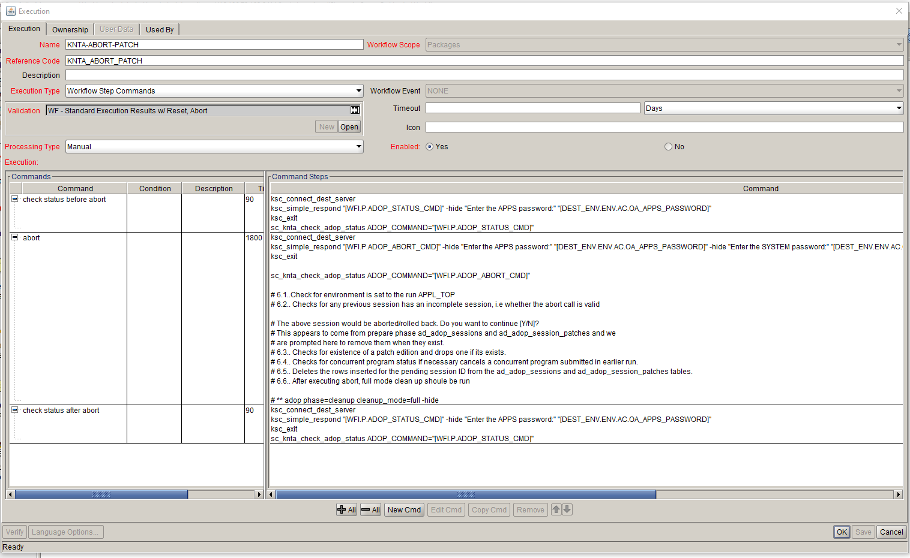

Validation : KNTA-ABORT-PATCH
Description: KNTA-ABORT-PATCH
  


<br>
<table>
<tr><td>Command</td><td><b>check status before abort</b></td></tr>
<tr><td>Condition</td><td><pre></pre></td></tr>
<tr><td>Description</td><td></td></tr>
<tr><td>Timeout(s)</td><td>90</td></tr>
<tr><td>Enabled?</td><td>Yes</td></tr>
<tr><td>Steps</td>
<td><pre>

ksc_connect_dest_server
ksc_simple_respond "[WFI.P.ADOP_STATUS_CMD]" -hide "Enter the APPS password:" "[DEST_ENV.ENV.AC.OA_APPS_PASSWORD]"
ksc_exit
sc_knta_check_adop_status ADOP_COMMAND="[WFI.P.ADOP_STATUS_CMD]"

</pre></td></tr>
</table>


<br>
<table>
<tr><td>Command</td><td><b>abort</b></td></tr>
<tr><td>Condition</td><td><pre></pre></td></tr>
<tr><td>Description</td><td></td></tr>
<tr><td>Timeout(s)</td><td>1800</td></tr>
<tr><td>Enabled?</td><td>Yes</td></tr>
<tr><td>Steps</td>
<td><pre>

ksc_connect_dest_server
ksc_simple_respond "[WFI.P.ADOP_ABORT_CMD]" -hide "Enter the APPS password:" "[DEST_ENV.ENV.AC.OA_APPS_PASSWORD]" -hide "Enter the SYSTEM password:" "[DEST_ENV.ENV.AC.OA_SYSTEM_PASSWORD]" -hide "Enter the WLSADMIN password:" 1Qaz2wsx
ksc_exit

sc_knta_check_adop_status ADOP_COMMAND="[WFI.P.ADOP_ABORT_CMD]"

```# 6.1..Check for environment is set to the run APPL_TOP```
```# 6.2.. Checks for any previous session has an incomplete session, i.e whether the abort call is valid```

```# The above session would be aborted/rolled back. Do you want to continue [Y/N]?```
```# This appears to come from prepare phase ad_adop_sessions and ad_adop_session_patches and we```
```# are prompted here to remove them when they exist.  ```
```# 6.3.. Checks for existence of a patch edition and drops one if its exists.```
```# 6.4.. Checks for concurrent program status if necessary cancels a concurrent program submitted in earlier run.```
```# 6.5.. Deletes the rows inserted for the pending session ID from the ad_adop_sessions and ad_adop_session_patches tables.```
```# 6.6.. After executing abort, full mode clean up shoule be run```

```# ** adop phase=cleanup cleanup_mode=full -hide```

</pre></td></tr>
</table>
<br>
<table>
<tr><td>Command</td><td><b>check status after abort</b></td></tr>
<tr><td>Condition</td><td><pre></pre></td></tr>
<tr><td>Description</td><td></td></tr>
<tr><td>Timeout(s)</td><td>90</td></tr>
<tr><td>Enabled?</td><td>Yes</td></tr>
<tr><td>Steps</td>
<td><pre>

ksc_connect_dest_server
ksc_simple_respond "[WFI.P.ADOP_STATUS_CMD]" -hide "Enter the APPS password:" "[DEST_ENV.ENV.AC.OA_APPS_PASSWORD]"
ksc_exit
sc_knta_check_adop_status ADOP_COMMAND="[WFI.P.ADOP_STATUS_CMD]"

</pre></td></tr>
</table>