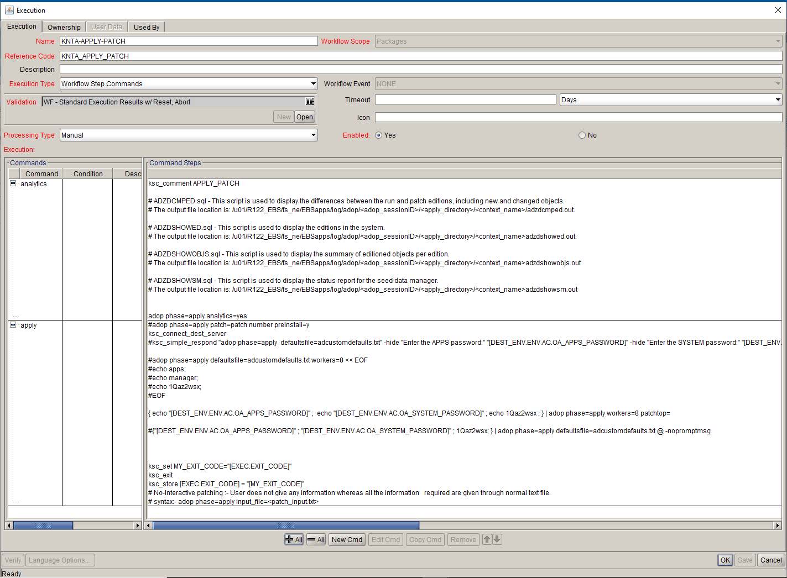

Validation : KNTA-APPLY-PATCH
Description: KNTA-APPLY-PATCH
  


<br>
<table>
<tr><td>Command</td><td><b>analytics</b></td></tr>
<tr><td>Condition</td><td><pre></pre></td></tr>
<tr><td>Description</td><td></td></tr>
<tr><td>Timeout(s)</td><td>90</td></tr>
<tr><td>Enabled?</td><td>Yes</td></tr>
<tr><td>Steps</td>
<td><pre>

```# ADZDCMPED.sql - This script is used to display the differences between the run and patch editions, including new and changed objects. ```
```# The output file location is: /u01/R122_EBS/fs_ne/EBSapps/log/adop/<adop_sessionID>/<apply_directory>/<context_name>/adzdcmped.out.```

```# ADZDSHOWED.sql - This script is used to display the editions in the system. ```
```# The output file location is: /u01/R122_EBS/fs_ne/EBSapps/log/adop/<adop_sessionID>/<apply_directory>/<context_name>adzdshowed.out.```

```# ADZDSHOWOBJS.sql - This script is used to display the summary of editioned objects per edition. ```
```# The output file location is: /u01/R122_EBS/fs_ne/EBSapps/log/adop/<adop_sessionID>/<apply_directory>/<context_name>adzdshowobjs.out```

```# ADZDSHOWSM.sql - This script is used to display the status report for the seed data manager. ```
```# The output file location is: /u01/R122_EBS/fs_ne/EBSapps/log/adop/<adop_sessionID>/<apply_directory>/<context_name>adzdshowsm.out```


adop phase=apply analytics=yes


</pre></td></tr>
</table>


<br>
<table>
<tr><td>Command</td><td><b>apply</b></td></tr>
<tr><td>Condition</td><td><pre></pre></td></tr>
<tr><td>Description</td><td></td></tr>
<tr><td>Timeout(s)</td><td>3800</td></tr>
<tr><td>Enabled?</td><td>Yes</td></tr>
<tr><td>Steps</td>
<td><pre>

```#adop phase=apply patch=patch number preinstall=y```
ksc_connect_dest_server
```#ksc_simple_respond "adop phase=apply  defaultsfile=adcustomdefaults.txt" -hide "Enter the APPS password:" "[DEST_ENV.ENV.AC.OA_APPS_PASSWORD]" -hide "Enter the SYSTEM password:" "[DEST_ENV.ENV.AC.OA_SYSTEM_PASSWORD]" -hide "Enter the WLSADMIN password:" 1Qaz2wsx "Enter command-line arguments for autopatch (if any here) :" "" "Is this the correct APPL_TOP [Yes] ?" "" ```

```#adop phase=apply defaultsfile=adcustomdefaults.txt workers=8 << EOF```
```#echo apps;```
```#echo manager;```
```#echo PasswordOrToken;```
```#EOF```

{ echo "[DEST_ENV.ENV.AC.OA_APPS_PASSWORD]" ;  echo "[DEST_ENV.ENV.AC.OA_SYSTEM_PASSWORD]" ; echo 1Qaz2wsx ; } | adop phase=apply workers=8 patchtop=

```#{"[DEST_ENV.ENV.AC.OA_APPS_PASSWORD]" ; "[DEST_ENV.ENV.AC.OA_SYSTEM_PASSWORD]" ; 1Qaz2wsx; } | adop phase=apply defaultsfile=adcustomdefaults.txt @ -nopromptmsg```


ksc_set MY_EXIT_CODE="[EXEC.EXIT_CODE]"
ksc_exit
ksc_store [EXEC.EXIT_CODE] = "[MY_EXIT_CODE]"
```# No-Interactive patching :- User does not give any information whereas all the information   required are given through normal text file.```
```# syntax:- adop phase=apply input_file=<patch_input.txt>```

</pre></td></tr>
</table>
