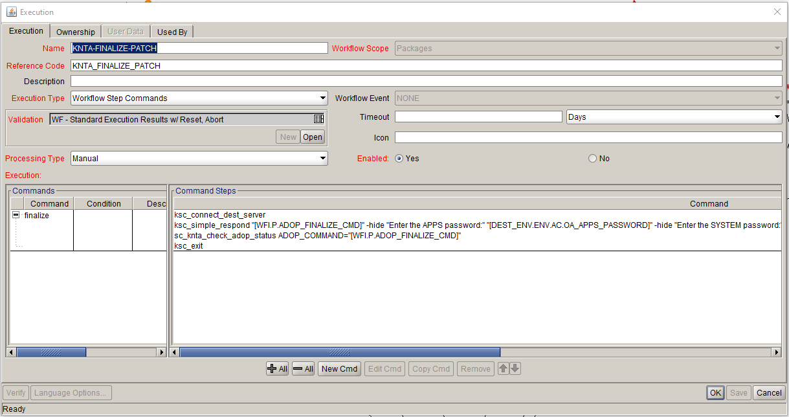

Validation : KNTA-FINALIZE-PATCH
Description: KNTA-FINALIZE-PATCH
  

 
<table>
<tr><td>Command</td><td><b>finalize</b></td></tr>
<tr><td>Condition</td><td><pre></pre></td></tr>
<tr><td>Description</td><td></td></tr>
<tr><td>Timeout(s)</td><td>1800</td></tr>
<tr><td>Enabled?</td><td>Yes</td></tr>
<tr><td>Steps</td>
<td><pre>

ksc_connect_dest_server
ksc_simple_respond "[WFI.P.ADOP_FINALIZE_CMD]" -hide "Enter the APPS password:" "[DEST_ENV.ENV.AC.OA_APPS_PASSWORD]" -hide "Enter the SYSTEM password:" "[DEST_ENV.ENV.AC.OA_SYSTEM_PASSWORD]" -hide "Enter the WLSADMIN password:" PasswordOrPasswordToken
sc_knta_check_adop_status ADOP_COMMAND="[WFI.P.ADOP_FINALIZE_CMD]"
ksc_exit

</pre></td></tr>
</table>

