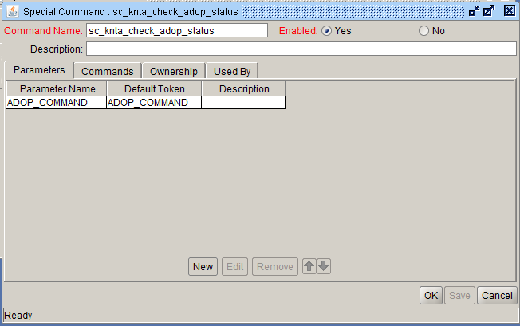
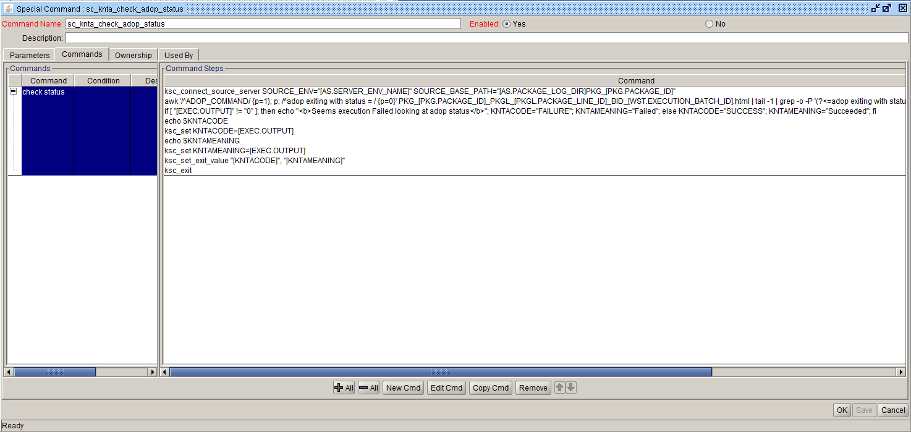

Validation : sc_knta_check_adop_status
Description: sc_knta_check_adop_status
  


<br>
<table>
<tr><td>Command</td><td><b>check status</b></td></tr>
<tr><td>Condition</td><td><pre></pre></td></tr>
<tr><td>Description</td><td></td></tr>
<tr><td>Enabled?</td><td>Yes</td></tr>
<tr><td>Steps</td>
<td><pre>

ksc_connect_source_server SOURCE_ENV="[AS.SERVER_ENV_NAME]" SOURCE_BASE_PATH="[AS.PACKAGE_LOG_DIR]PKG_[PKG.PACKAGE_ID]"
```awk '/^ADOP_COMMAND/ {p=1}; p; /^adop exiting with status = / {p=0}' PKG_[PKG.PACKAGE_ID]_PKGL_[PKGL.PACKAGE_LINE_ID]_BID_[WST.EXECUTION_BATCH_ID].html | tail -1 | grep -o -P '(?<=adop exiting with status = ).*(?= \()'```
if [ "[EXEC.OUTPUT]" != "0" ]; then echo "<b>Seems execution Failed looking at adop status</b>"; KNTACODE="FAILURE"; KNTAMEANING="Failed"; else KNTACODE="SUCCESS"; KNTAMEANING="Succeeded"; fi
echo $KNTACODE
ksc_set KNTACODE=[EXEC.OUTPUT]
echo $KNTAMEANING
ksc_set KNTAMEANING=[EXEC.OUTPUT]
ksc_set_exit_value "[KNTACODE]", "[KNTAMEANING]"
ksc_exit

</pre></td></tr>
</table>

