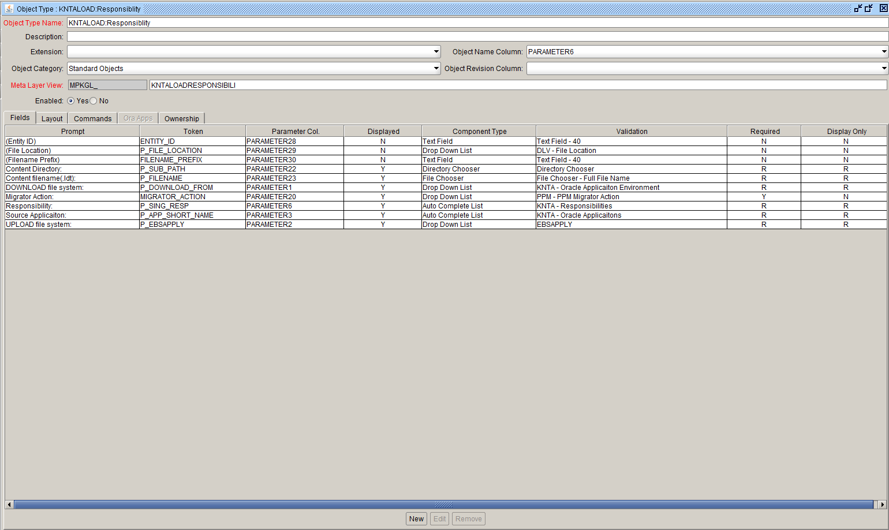
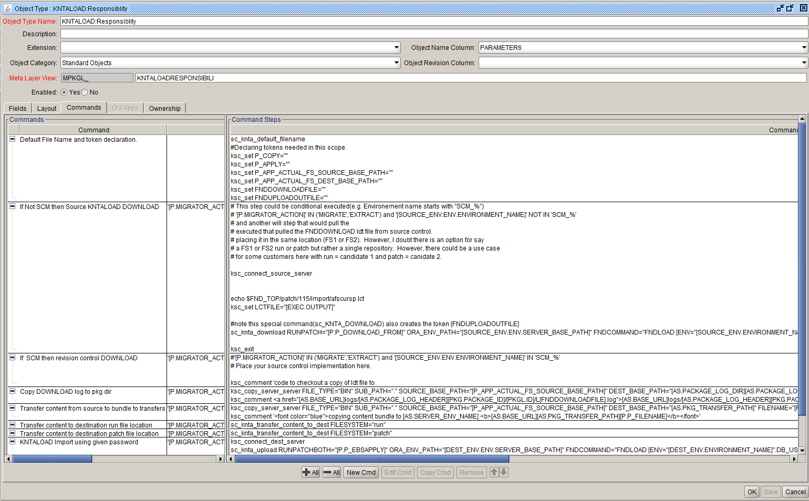

Validation : KNTALOAD:Responsiblity
Description: KNTALOAD:Responsiblity
 




Commands:<BR>
<table>
<tr><td>Command</td><td><b>Default File Name and token declaration.</b></td></tr>
<tr><td>Condition</td><td><pre></pre></td></tr>
<tr><td>Description</td><td></td></tr>
<tr><td>Timeout(s)</td><td>360</td></tr>
<tr><td>Enabled?</td><td>Yes</td></tr>
<tr><td>Steps</td>
<td><pre>

sc_knta_default_filename
```#Declaring tokens needed in this scope.```
ksc_set P_COPY=""
ksc_set P_APPLY=""
ksc_set P_APP_ACTUAL_FS_SOURCE_BASE_PATH=""
ksc_set P_APP_ACTUAL_FS_DEST_BASE_PATH=""
ksc_set FNDDOWNLOADFILE=""
ksc_set FNDUPLOADOUTFILE=""

</pre></td></tr>
</table>

<br>
<table>
<tr><td>Command</td><td><b>If Not SCM then Source KNTALOAD DOWNLOAD</b></td></tr>
<tr><td>Condition</td><td><pre>'[P.MIGRATOR_ACTION]' IN ('MIGRATE','EXTRACT') and '[SOURCE_ENV.ENV.ENVIRONMENT_NAME]' NOT IN 'SCM_%'</pre></td></tr>
<tr><td>Description</td><td>call FNDLOAD download when not souce control</td></tr>
<tr><td>Timeout(s)</td><td>4800</td></tr>
<tr><td>Enabled?</td><td>Yes</td></tr>
<tr><td>Steps</td>
<td><pre>

```# This step could be conditional executed(e.g. Environement name starts with "SCM_%") ```
```# '[P.MIGRATOR_ACTION]' IN ('MIGRATE','EXTRACT') and '[SOURCE_ENV.ENV.ENVIRONMENT_NAME]' NOT IN 'SCM_%'```
```# and another will step that would pull the ```
```# executed that pulled the FNDDOWNLOAD ldt file from source control.```
```# placing it in the same location (FS1 or FS2).  However, I doubt there is an option for say```
```# a FS1 or FS2 run or patch but rather a single repository.  However, there could be a use case```
```# for some customers here with run = candidate 1 and patch = canidate 2.```
 
ksc_connect_source_server


echo $FND_TOP/patch/115/import/afscursp.lct 
ksc_set LCTFILE="[EXEC.OUTPUT]"

```#note this special command(sc_KNTA_DOWNLOAD) also creates the token [FNDUPLOADOUTFILE]```
sc_knta_download RUNPATCH="[P.P_DOWNLOAD_FROM]" ORA_ENV_PATH="[SOURCE_ENV.ENV.SERVER_BASE_PATH]" FNDCOMMAND="FNDLOAD [ENV="[SOURCE_ENV.ENVIRONMENT_NAME]".DB_USERNAME]/[ENV="[SOURCE_ENV.ENVIRONMENT_NAME]".DB_PASSWORD] O Y DOWNLOAD '[LCTFILE]' [P.P_FILENAME] FND_RESPONSIBILITY RESP_KEY=[P.P_SING_RESP]"

ksc_exit

</pre></td></tr>
</table>

<br>
<table>
<tr><td>Command</td><td><b>If  SCM then revision control DOWNLOAD</b></td></tr>
<tr><td>Condition</td><td><pre>'[P.MIGRATOR_ACTION]' IN ('MIGRATE','EXTRACT') and '[SOURCE_ENV.ENV.ENVIRONMENT_NAME]'  IN 'SCM_%'</pre></td></tr>
<tr><td>Description</td><td></td></tr>
<tr><td>Timeout(s)</td><td>90</td></tr>
<tr><td>Enabled?</td><td>Yes</td></tr>
<tr><td>Steps</td>
<td><pre>

```#'[P.MIGRATOR_ACTION]' IN ('MIGRATE','EXTRACT') and '[SOURCE_ENV.ENV.ENVIRONMENT_NAME]' IN 'SCM_%'```
```# Place your source control implementation here.```

ksc_comment 'code to checkout a copy of ldt file to 

</pre></td></tr>
</table>

<br>
<table>
<tr><td>Command</td><td><b>Copy DOWNLOAD log to pkg dir</b></td></tr>
<tr><td>Condition</td><td><pre>'[P.MIGRATOR_ACTION]' IN ('MIGRATE','EXTRACT') AND '[SOURCE_ENV.ENV.ENVIRONMENT_NAME]'  NOT IN 'SCM_%'</pre></td></tr>
<tr><td>Description</td><td><pre>copy log back to applicaiton server if environment is not 'SCM_%'</pre></td></tr>
<tr><td>Timeout(s)</td><td>180</td></tr>
<tr><td>Enabled?</td><td>Yes</td></tr>
<tr><td>Steps</td>
<td><pre>

ksc_copy_server_server FILE_TYPE="BIN" SUB_PATH="." SOURCE_BASE_PATH="[P_APP_ACTUAL_FS_SOURCE_BASE_PATH]" DEST_BASE_PATH="[AS.PACKAGE_LOG_DIR][AS.PACKAGE_LOG_HEADER][PKG.PACKAGE_ID]/[PKGL.ID]/" FILENAME="L[FNDDOWNLOADFILE].log" DEST_ENV="[AS.SERVER_ENV_NAME]"
ksc_comment <a href="[AS.BASE_URL]logs/[AS.PACKAGE_LOG_HEADER][PKG.PACKAGE_ID]/[PKGL.ID]/L[FNDDOWNLOADFILE].log">[AS.BASE_URL]logs/[AS.PACKAGE_LOG_HEADER][PKG.PACKAGE_ID]/[PKGL.ID]/L[FNDDOWNLOADFILE].log</a>

</pre></td></tr>
</table>

<br>
<table>
<tr><td>Command</td><td><b>Transfer content from source to bundle to transfers</b></td></tr>
<tr><td>Condition</td><td><pre>'[P.MIGRATOR_ACTION]' IN ('MIGRATE','EXTRACT')</pre></td></tr>
<tr><td>Description</td><td></td></tr>
<tr><td>Timeout(s)</td><td>180</td></tr>
<tr><td>Enabled?</td><td>Yes</td></tr>
<tr><td>Steps</td>
<td><pre>

ksc_copy_server_server FILE_TYPE="BIN" SUB_PATH="." SOURCE_BASE_PATH="[P_APP_ACTUAL_FS_SOURCE_BASE_PATH]" DEST_BASE_PATH="[AS.PKG_TRANSFER_PATH]" FILENAME="[P.P_FILENAME]" DEST_ENV="[AS.SERVER_ENV_NAME]"
ksc_comment '<font color="blue">copying content bundle to [AS.SERVER_ENV_NAME] <b>[AS.BASE_URL][AS.PKG_TRANSFER_PATH][P.P_FILENAME]</b></font>'

</pre></td></tr>
</table>


<br>
<table>
<tr><td>Command</td><td><b>Transfer content to destination run file location</b></td></tr>
<tr><td>Condition</td><td><pre>'[P.MIGRATOR_ACTION]' IN ('MIGRATE','IMPORT') AND '[P.P_EBSAPPLY]' IN ('RUN','BOTHRUN', 'BOTHPATCH', 'COPYRUN', 'COPYBOTH')</pre></td></tr>
<tr><td>Description</td><td></td></tr>
<tr><td>Timeout(s)</td><td>90</td></tr>
<tr><td>Enabled?</td><td>Yes</td></tr>
<tr><td>Steps</td>
<td><pre>

sc_knta_transfer_content_to_dest FILESYSTEM="run"

</pre></td></tr>
</table>


<br>
<table>
<tr><td>Command</td><td><b>Transfer content to destination patch file location</b></td></tr>
<tr><td>Condition</td><td><pre>'[P.MIGRATOR_ACTION]' IN ('MIGRATE','IMPORT') AND '[P.P_EBSAPPLY]' IN ('PATCH','BOTHPATCH', 'BOTHRUN', 'COPYPATCH', 'COPYBOTH')</pre></td></tr>
<tr><td>Description</td><td></td></tr>
<tr><td>Timeout(s)</td><td>90</td></tr>
<tr><td>Enabled?</td><td>Yes</td></tr>
<tr><td>Steps</td>
<td><pre>

sc_knta_transfer_content_to_dest FILESYSTEM="patch"

</pre></td></tr>
</table>


<br>
<table>
<tr><td>Command</td><td><b>KNTALOAD Import using given password</b></td></tr>
<tr><td>Condition</td><td><pre>'[P.MIGRATOR_ACTION]' IN ('MIGRATE','IMPORT')</pre></td></tr>
<tr><td>Description</td><td>call KNTALOAD upload</td></tr>
<tr><td>Timeout(s)</td><td>4800</td></tr>
<tr><td>Enabled?</td><td>Yes</td></tr>
<tr><td>Steps</td>
<td><pre>

ksc_connect_dest_server
sc_knta_upload RUNPATCHBOTH="[P.P_EBSAPPLY]" ORA_ENV_PATH="[DEST_ENV.ENV.SERVER_BASE_PATH]" FNDCOMMAND="FNDLOAD [ENV="[DEST_ENV.ENVIRONMENT_NAME]".DB_USERNAME]/[ENV="[DEST_ENV.ENVIRONMENT_NAME]".DB_PASSWORD] O Y UPLOAD $FND_TOP/patch/115/import/afscursp.lct [P.P_FILENAME]" 
ksc_exit

</pre></td></tr>
</table>

<br>
<table>
<tr><td>Command</td><td><b>copy FNDLOAD upload log to pkg dir</b></td></tr>
<tr><td>Condition</td><td><pre>'[P.MIGRATOR_ACTION]' IN ('MIGRATE', 'IMPORT')</pre></td></tr>
<tr><td>Description</td><td></td></tr>
<tr><td>Timeout(s)</td><td>90</td></tr>
<tr><td>Enabled?</td><td>Yes</td></tr>
<tr><td>Steps</td>
<td><pre>

ksc_copy_server_server FILE_TYPE="BIN" SUB_PATH="." SOURCE_ENV="[DEST_ENV.ENV.ENVIRONMENT_NAME]" SOURCE_BASE_PATH="[P_APP_ACTUAL_FS_DEST_BASE_PATH]" DEST_BASE_PATH="[AS.PACKAGE_LOG_DIR][AS.PACKAGE_LOG_HEADER][PKG.PACKAGE_ID]/[PKGL.ID]/" FILENAME="[FNDUPLOADOUTFILE]" DEST_ENV="[AS.SERVER_ENV_NAME]"
ksc_comment <a href="[AS.BASE_URL]logs/[AS.PACKAGE_LOG_HEADER][PKG.PACKAGE_ID]/[PKGL.ID]/[FNDUPLOADOUTFILE]">[AS.BASE_URL]logs/[AS.PACKAGE_LOG_HEADER][PKG.PACKAGE_ID]/[PKGL.ID]/[FNDUPLOADOUTFILE]</a>

</pre></td></tr>
</table>


<br>
<table>
<tr><td>Command</td><td><b>Clean up temp files</b></td></tr>
<tr><td>Condition</td><td><pre>'[P.MIGRATOR_ACTION]' = 'MIGRATE'</pre></td></tr>
<tr><td>Description</td><td></td></tr>
<tr><td>Timeout(s)</td><td>120</td></tr>
<tr><td>Enabled?</td><td>Yes</td></tr>
<tr><td>Steps</td>
<td><pre>

ksc_mig_cleanup_temp_files

</pre></td></tr>
</table>