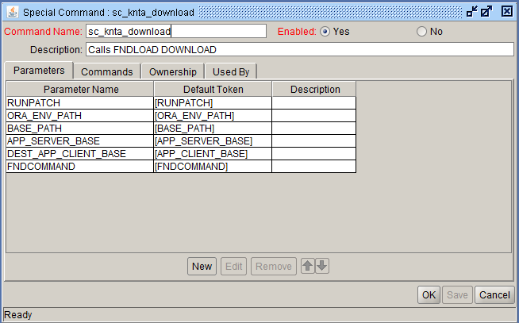
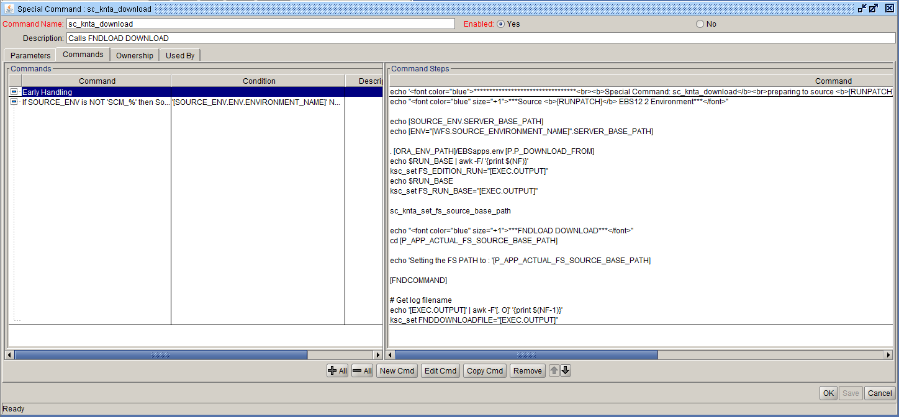

  special command : sc_knta_download 
  

Commands:

Command: Early Handling
Steps:
<pre>echo '********************************* <b>Special Command: sc_knta_download</b> preparing to source <b>[RUNPATCH]</b> filesystem. ********************************* '</pre>
 

Command: If not source control managment
Condition:
<pre>'[SOURCE_ENV.ENV.ENVIRONMENT_NAME]' NOT IN 'SCM_%'</pre>

Steps:
<pre>
echo "***Source <b>[RUNPATCH]</b> EBS12 2 Environment***"

echo [SOURCE_ENV.SERVER_BASE_PATH]
echo [ENV="[WFS.SOURCE_ENVIRONMENT_NAME]".SERVER_BASE_PATH]

. [ORA_ENV_PATH]/EBSapps.env [P.P_DOWNLOAD_FROM]
echo $RUN_BASE | awk -F/ '{print $(NF)}'
ksc_set FS_EDITION_RUN="[EXEC.OUTPUT]"
echo $RUN_BASE
ksc_set FS_RUN_BASE="[EXEC.OUTPUT]"

sc_knta_set_fs_source_base_path

echo "***FNDLOAD DOWNLOAD***"
cd [P_APP_ACTUAL_FS_SOURCE_BASE_PATH]

echo 'Setting the FS PATH to : '[P_APP_ACTUAL_FS_SOURCE_BASE_PATH]

[FNDCOMMAND]

# Get log filename
echo '[EXEC.OUTPUT]' | awk -F'[. O]' '{print $(NF-1)}'
ksc_set FNDDOWNLOADFILE="[EXEC.OUTPUT]"
</pre>