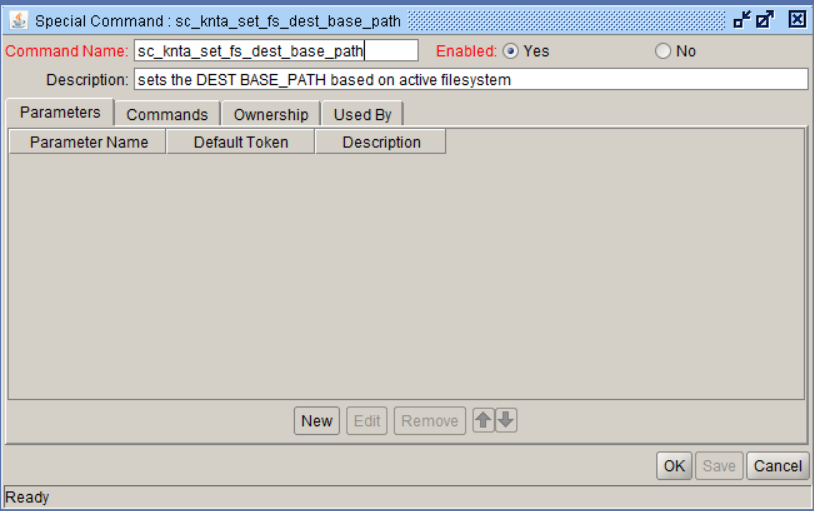
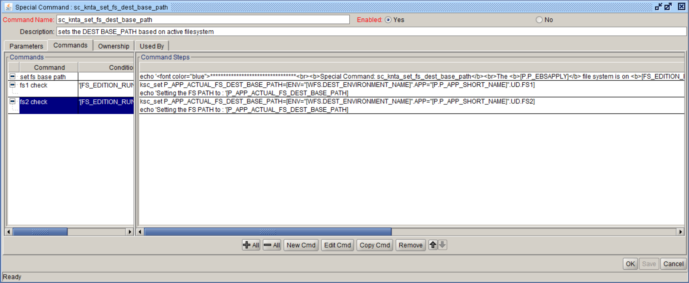

Special Command : sc_knta_set_fs_dest_base_path 
Description: sets the DEST BASE_PATH based on active filesystem
  

Parameter Name    Default Token

 

Commands:

Command: set fs base path  
Steps:
<pre><code>
echo '********************************* <b>Special Command: sc_knta_set_fs_dest_base_path</b> The <b>[P.P_EBSAPPLY]</b> file system is on <b>[FS_EDITION_RUN]</b>. Environment: [WFS.DEST_ENVIRONMENT_NAME] App code: [P.P_APP_SHORT_NAME] *********************************'
</code></pre>
 
Command: fs1 check 
Condition: <pre>'[FS_EDITION_RUN]'='fs1'</pre>  
Description: FS1 check  

Steps:
<pre>
ksc_set P_APP_ACTUAL_FS_DEST_BASE_PATH=[ENV="[WFS.DEST_ENVIRONMENT_NAME]".APP="[P.P_APP_SHORT_NAME]".UD.FS1]
echo 'Setting the FS PATH to : '[P_APP_ACTUAL_FS_DEST_BASE_PATH]
</pre>

 
Command: fs2 check 
Condition: <pre>'[FS_EDITION_RUN]'='fs2'</pre>  
Description: FS2 check 

Steps:
<pre>
ksc_set P_APP_ACTUAL_FS_DEST_BASE_PATH=[ENV="[WFS.DEST_ENVIRONMENT_NAME]".APP="[P.P_APP_SHORT_NAME]".UD.FS2]
echo 'Setting the FS PATH to : '[P_APP_ACTUAL_FS_DEST_BASE_PATH]
</pre>