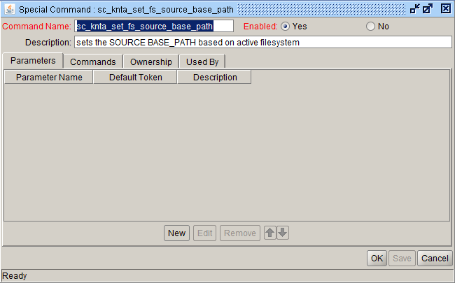
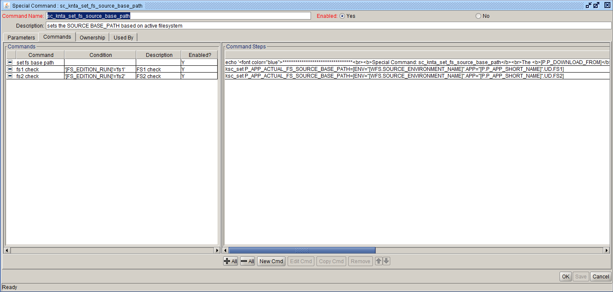

Special Command : sc_knta_set_fs_source_base_path
Description: sc_knta_set_fs_source_base_path
  





Commands:<BR>
<table>
<tr><td>Command</td><td><b>set fs base path</b></td></tr>
<tr><td>Condition</td><td></td></tr>
<tr><td>Description</td><td></td></tr>
<tr><td>Enabled?</td><td>Yes</td></tr>
<tr><td>Steps</td>
<td><pre>

```echo '<font color="blue">*********************************<br><b>Special Command: sc_knta_set_fs_source_base_path</b><br>The <b>[P.P_DOWNLOAD_FROM]</b> file system is on <b>[FS_EDITION_RUN]</b>.<br>Environment: [WFS.SOURCE_ENVIRONMENT_NAME]<br>App code: [P.P_APP_SHORT_NAME]<br>*********************************</font>'```
</pre></td></tr>
</table>
<br>
<table>
<tr><td>Command</td><td><b>fs1 check</b></td></tr>
<tr><td>Condition</td><td><pre>'[FS_EDITION_RUN]'='fs1'</pre></td></tr>
<tr><td>Description</td><td></td></tr>
<tr><td>Enabled?</td><td>Yes</td></tr>
<tr><td>Steps</td>
<td><pre>

ksc_set P_APP_ACTUAL_FS_SOURCE_BASE_PATH=[ENV="[WFS.SOURCE_ENVIRONMENT_NAME]".APP="[P.P_APP_SHORT_NAME]".UD.FS1]

</pre></td></tr>
</table>
<br>
<table>
<tr><td>Command</td><td><b>fs2 check</b></td></tr>
<tr><td>Condition</td><td><pre>'[FS_EDITION_RUN]'='fs2'</pre></td></tr>
<tr><td>Description</td><td></td></tr>
<tr><td>Enabled?</td><td>Yes</td></tr>
<tr><td>Steps</td>
<td><pre>

ksc_set P_APP_ACTUAL_FS_SOURCE_BASE_PATH=[ENV="[WFS.SOURCE_ENVIRONMENT_NAME]".APP="[P.P_APP_SHORT_NAME]".UD.FS2]

</pre></td></tr>
</table>