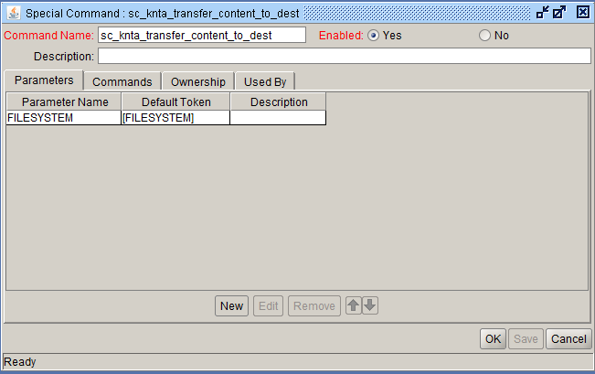
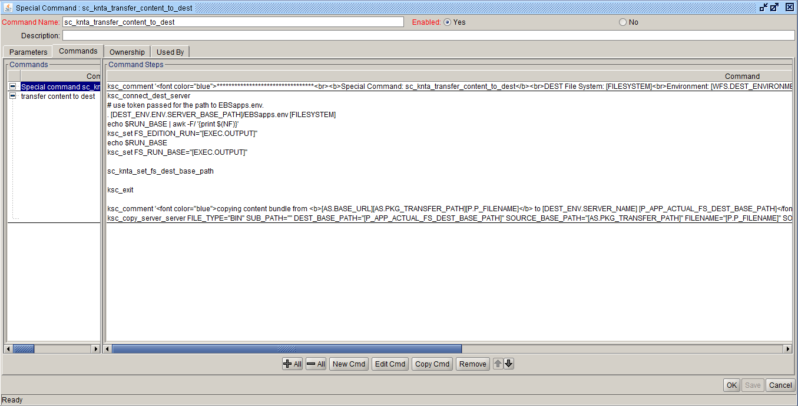

Special Command : sc_knta_transfer_content_to_dest 
Description: sc_knta_transfer_content_to_dest
  

Parameter Name    Default Token
<pre>
FILESYSTEM              [FILESYSTEM]
</pre>

Commands:

Command: Special command sc_knta_transfer_content_to_dest
Steps:
<pre>
ksc_comment '********************************* <b>Special Command: sc_knta_transfer_content_to_dest</b> DEST File System: [FILESYSTEM] Environment: [WFS.DEST_ENVIRONMENT_NAME] App code: [P.P_APP_SHORT_NAME] copying content bundle *********************************'
</pre>
 

Command: transfer content to dest 
Condition: 

Steps:
<pre>
ksc_connect_dest_server
# use token passed for the path to EBSapps.env.  
. [DEST_ENV.ENV.SERVER_BASE_PATH]/EBSapps.env [FILESYSTEM]
echo $RUN_BASE | awk -F/ '{print $(NF)}'
ksc_set FS_EDITION_RUN="[EXEC.OUTPUT]"
echo $RUN_BASE
ksc_set FS_RUN_BASE="[EXEC.OUTPUT]"

sc_knta_set_fs_dest_base_path

ksc_exit

ksc_comment 'copying content bundle from <b>[AS.BASE_URL][AS.PKG_TRANSFER_PATH][P.P_FILENAME]</b> to [DEST_ENV.SERVER_NAME] [P_APP_ACTUAL_FS_DEST_BASE_PATH]'
ksc_copy_server_server FILE_TYPE="BIN" SUB_PATH="" DEST_BASE_PATH="[P_APP_ACTUAL_FS_DEST_BASE_PATH]" SOURCE_BASE_PATH="[AS.PKG_TRANSFER_PATH]" FILENAME="[P.P_FILENAME]" SOURCE_ENV="[AS.SERVER_ENV_NAME]"
</pre>