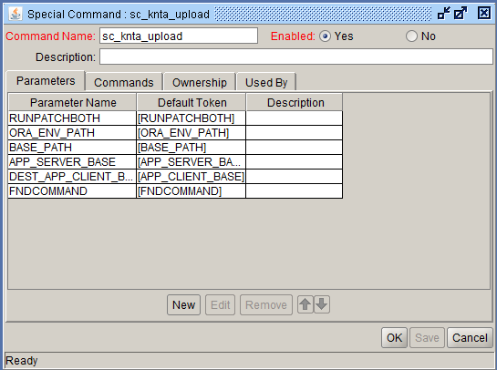
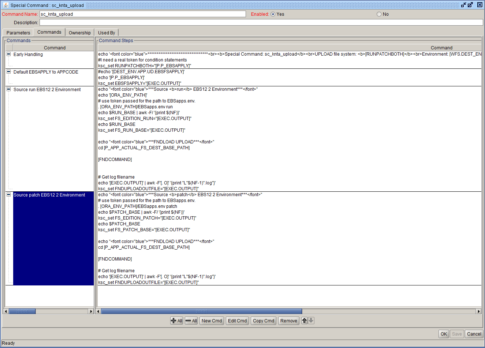

Special Command : sc_knta_upload 
Description: Calls FNDLOAD UPLOAD
  

Parameter Name    Default Token
<pre>
RUNPATCHBOTH            [RUNPATCHBOTH]
ORA_ENV_PATH            [ORA_ENV_PATH]
BASE_PATH               [BASE_PATH]
APP_SERVER_BASE         [APP_SERVER_BASE]
DEST_APP_CLIENT_BASE    [APP_CLIENT_BASE]
FNDCOMMAND              [FNDCOMMAND]
</pre>



Commands:

<table>
<tr><td>Command</td><td><b>Early Handling</b></td></tr>
<tr><td>Condition</td><td></td></tr>
<tr><td>Description</td><td></td></tr>
<tr><td>Enabled?</td><td>Yes</td></tr>
<tr><td>Steps</td>
<td><pre>

```echo "<font color="blue">*********************************<br><b>Special Command: sc_knta_upload</b><br>UPLOAD file system: <b>[RUNPATCHBOTH]</b><br>Environment: [WFS.DEST_ENVIRONMENT_NAME]<br>App code: [P.P_APP_SHORT_NAME]<br>*********************************</font>" ```
```#I need a real token for condition statements```
ksc_set RUNPATCHBOTH="[P.P_EBSAPPLY]"
</pre></td></tr>
</table>

<BR>

<table>
<tr><td>Command</td><td><b>Default EBSAPPLY to APPCODE</b></td></tr>
<tr><td>Condition</td><td><pre>'[P.DEST_ENV.APP.UD.EBSFSAPPLY]' IS NOT NULL</pre></td></tr>
<tr><td>Description</td><td></td></tr>
<tr><td>Enabled?</td><td>Yes</td></tr>
<tr><td>Steps</td>
<td><pre>

```
#echo '[DEST_ENV.APP.UD.EBSFSAPPLY]'
echo '[P.P_EBSAPPLY]'
ksc_set EBSFSAPPLY="[EXEC.OUTPUT]"
```
</pre></td></tr>
</table>
<BR>

<table>
<tr><td>Command</td><td><b>Source run EBS12 2 Environment</b></td></tr>
<tr><td>Condition</td><td><pre>'[P.P_EBSAPPLY]' IN ('RUN','BOTHRUN')</pre></td></tr>
<tr><td>Description</td><td></td></tr>
<tr><td>Enabled?</td><td>Yes</td></tr>
<tr><td>Steps</td>
<td><pre>

```# use token passed for the path to EBSapps.env.  ```
. [ORA_ENV_PATH]/EBSapps.env run
echo $RUN_BASE | awk -F/ '{print $(NF)}'
ksc_set FS_EDITION_RUN="[EXEC.OUTPUT]"
echo $RUN_BASE
ksc_set FS_RUN_BASE="[EXEC.OUTPUT]"

```echo "<font color="blue">***FNDLOAD UPLOAD***</font>"```
cd [P_APP_ACTUAL_FS_DEST_BASE_PATH]

[FNDCOMMAND]


```# Get log filename```
```echo '[EXEC.OUTPUT]' | awk -F'[. O]' '{print "L"$(NF-1)".log"}'```
ksc_set FNDUPLOADOUTFILE="[EXEC.OUTPUT]"
</pre></td></tr>
</table>

<BR>

Command: <b>Source patch EBS12 2 Environment</b><BR>
Condition:
<pre>'[P.P_EBSAPPLY]' IN ('PATCH','BOTHPATCH')</pre>

Steps:
```
echo "<font color="blue">***Source <b>patch</b> EBS12 2 Environment***</font>"
# use token passed for the path to EBSapps.env.  
. [ORA_ENV_PATH]/EBSapps.env patch
echo $PATCH_BASE | awk -F/ '{print $(NF)}'
ksc_set FS_EDITION_PATCH="[EXEC.OUTPUT]"
echo $PATCH_BASE
ksc_set FS_PATCH_BASE="[EXEC.OUTPUT]"

echo "<font color="blue">***FNDLOAD UPLOAD***</font>"
cd [P_APP_ACTUAL_FS_DEST_BASE_PATH]

[FNDCOMMAND]

# Get log filename
echo '[EXEC.OUTPUT]' | awk -F'[. O]' '{print "L"$(NF-1)".log"}'
ksc_set FNDUPLOADOUTFILE="[EXEC.OUTPUT]"
```